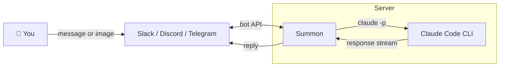

# Summon

> **Early beta** — this project is under active development. Things may break, APIs may change. Contributions and feedback welcome.

Talk to Claude from your chat apps. Powered by [Claude Code CLI](https://code.claude.com) and your Claude Max subscription — no API keys, no per-token costs.

Send a message in Slack, Claude works on your codebase and responds. Paste an image, Claude sees it. It's Claude Code, but you reach it from wherever you already are.

## How it works

Summon runs on your machine (or a server), connects to your chat apps via their bot APIs, and forwards messages to `claude -p` — the same CLI you use in your terminal. Responses stream back to the chat.



- **Project mode** — `!work my-app` points Claude at a project directory. Every message becomes a coding task with full file access.
- **General mode** — Without a project selected, Claude acts as a general assistant.
- **Image support** — Paste screenshots, schedules, diagrams. Claude sees them via vision.
- **Google Calendar** — Check your schedule, create and delete events.
- **Session continuity** — Conversations persist across messages, so Claude has context.

## Supported chat apps

| App | Status | Features |
|-----|--------|----------|
| Slack | Stable | Text, images, message editing, reactions |
| Discord | Stable | Text, message editing, reactions |
| Telegram | Stable | Text, message editing, reactions |
| WhatsApp | Experimental | Text only |

## Quick start

### Prerequisites

- Node.js 20+
- [Claude Code CLI](https://code.claude.com) installed and authenticated
- A Claude Max subscription (or Pro — Max recommended for heavier use)

### 1. Clone and install

```bash
git clone https://github.com/your-username/summon.git
cd summon
npm install
```

### 2. Set up a chat app

You need at least one. See [SETUP.md](SETUP.md) for detailed Slack setup instructions.

**Slack (recommended):**
1. Create a Slack app at https://api.slack.com/apps
2. Enable Socket Mode, add bot scopes: `chat:write`, `files:read`, `im:history`, `im:read`, `im:write`, `reactions:write`
3. Subscribe to `message.im` events
4. Install to workspace

### 3. Configure

```bash
cp .env.example .env
# Fill in your bot tokens
```

### 4. Run

```bash
./start.sh
```

Or directly:

```bash
node src/index.js
```

## Usage

| Command | What it does |
|---------|-------------|
| `!work <project>` | Switch to a project (coding mode) |
| `!stop` | Back to general assistant mode |
| `!projects` | List available projects |
| `!new` | Start a fresh conversation |
| `!status` | Show current project and session |
| `!calendar` | Today's events |
| `!help` | Show all commands |

In project mode, every message goes to Claude Code with full access to your codebase. Ask it to write code, fix bugs, review files — anything you'd do in the terminal.

## Why Claude Code CLI?

Summon uses `claude -p` (Claude Code's non-interactive mode) under the hood. This is the same official CLI that powers CI/CD integrations, GitHub Actions, and scripted workflows. Your messages are processed by the real Claude Code binary — not a third-party wrapper, not an extracted token.

This means you get Claude Code's full capabilities: file editing, shell commands, project context, and tool use — all triggered from a chat message instead of a terminal prompt.

## Project structure

```
src/
  index.js          — Entry point, adapter loading
  core.js           — Message routing and handling
  claude.js         — Claude CLI integration
  messages.js       — Command parsing
  session.js        — Conversation session management
  chunker.js        — Response splitting for message limits
  markdown.js       — Markdown conversion per platform
  projects.js       — Project directory listing
  skills.js         — Skills/tools framework
  calendar.js       — Google Calendar integration
  adapters/
    base.js         — Base adapter interface
    slack.js        — Slack (Socket Mode)
    discord.js      — Discord
    telegram.js     — Telegram (grammy)
    whatsapp.js     — WhatsApp (Baileys)
```

## License

ISC
